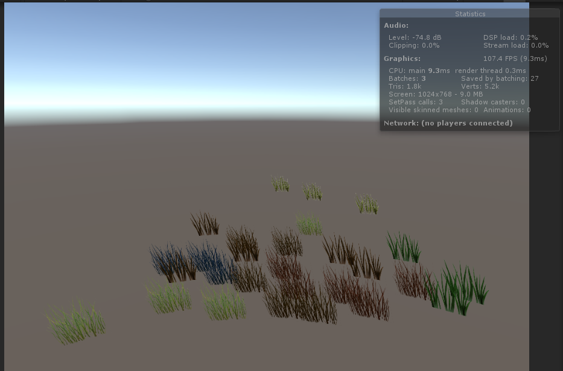
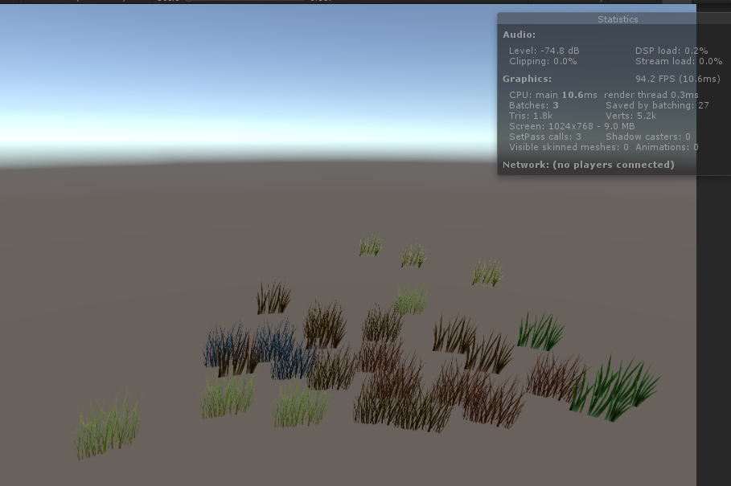
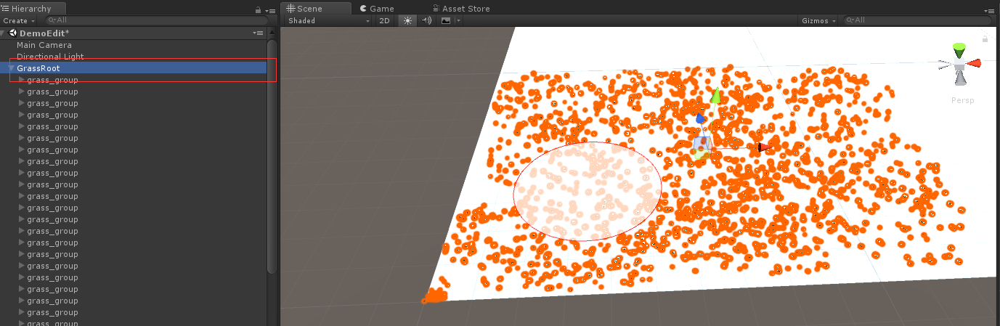
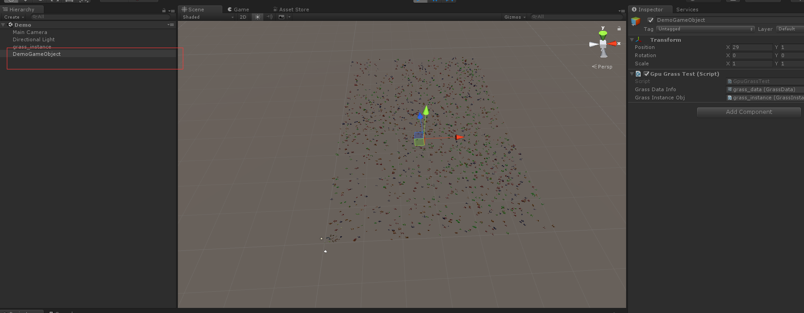

# GpuInstanceGrass
## 介绍

unity GpuInstance合批的可摆动的草,支持设置草颜色

已支持：

- GpuInstance合批
- 可以对每颗草设置颜色 位置 缩放
- 草分块（运行时只渲染附近格子的草）
- 编辑模式批量刷草

## demo使用

Demo\Scene\DemoEdit.unity 编辑草   选中此节点在场景中点击种草

Demo\Scene\Demo.unity 运行实例  

可以拖动DemoGameObject来看看分块加载

